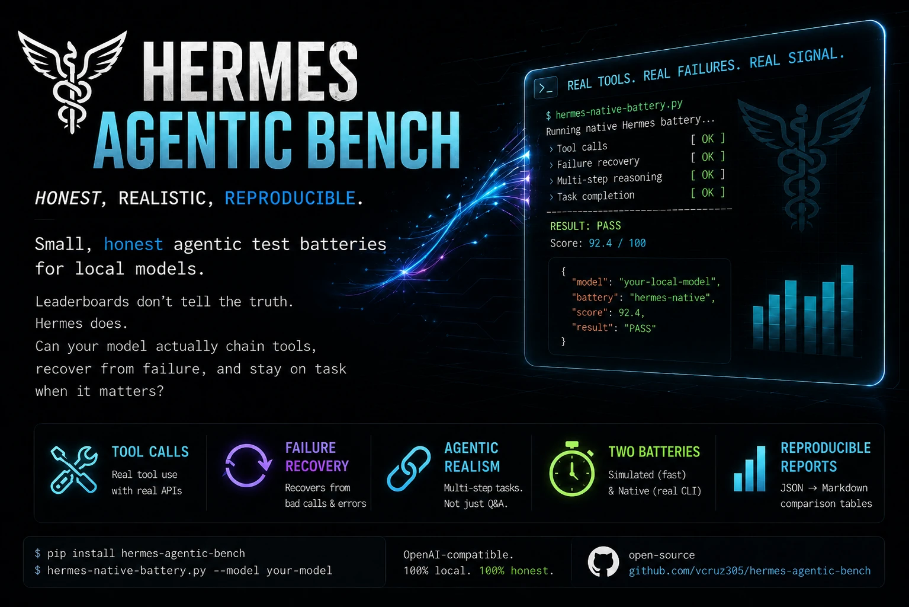

[](LICENSE)
[](https://www.python.org/downloads/)
[](https://github.com/vcruz305/hermes-agentic-bench/pulls)
[](https://github.com/vcruz305/hermes-agentic-bench)

# hermes-agentic-bench

Small, honest agentic test batteries for local models — written because there's no
published benchmark for models plugged into [Hermes Agent](https://hermes-agent.nousresearch.com),
and static leaderboard numbers don't tell you whether a model can actually chain tools,
recover from a failed call, or stay on task when something it needs isn't configured.

Three scripts, two levels of realism:

- **`simulated_battery.py`** — talks directly to an OpenAI-compatible endpoint (e.g. a
  local `llama-server`) with hand-scripted tool responses. Fast, cheap, good for a first
  read on tool-calling and reasoning-budget behavior. Six scenarios.
- **`hermes_loop_gate.py`** — **20-task gate** for the failure the community actually
  reports on Muse+Hermes: valid OpenAI `tool_calls` that never stop (50–150 `terminal`
  loops), duplicate `(name, args)`, ATEM/XML that Hermes cannot parse, or hitting the
  turn cap with no user answer. Scripted Hermes-shaped tools (`terminal`, `read_file`,
  `search_files`, `web_search`, `write_file`). Use this before claiming a fine-tune
  helped. Serve notes: [docs/muse-hermes-serve.md](docs/muse-hermes-serve.md).
- **`hermes_native_battery.py`** — drives the actual `hermes chat -q` CLI with real
  toolsets and real tool failures. Slower and messier, but it's what your model will
  actually do in production. **The batteries do not always agree** — that gap is
  itself informative (see "Known limitations" below).

`generate_report.py` turns one or more result JSON files into a Markdown comparison table.

This came out of an actual comparison ([Muse Glimmer 30B vs. Bonsai 27B](https://claude.ai/code/artifact/af013b83-dc66-4865-a6eb-ad7a2918cddf))
where the simulated battery said one thing and the real Hermes sessions said another —
that discrepancy is the reason this repo has two scripts instead of one.

## Prerequisites

- Python 3.9+
- For `simulated_battery.py`: any OpenAI-compatible chat completions endpoint
  (llama.cpp's `llama-server`, vLLM, etc.) — `pip install -r requirements.txt`
- For `hermes_native_battery.py`: [Hermes Agent](https://hermes-agent.nousresearch.com)
  installed, with your model(s) registered as a `provider` in `config.yaml`

## Quick start

```bash
pip install -r requirements.txt

# Simulated battery against a raw endpoint
python simulated_battery.py \
  --base-url http://127.0.0.1:8080/v1 --api-key local-key \
  --model my-model --temperature 0.6 --top-p 0.95 --top-k 20 \
  --output results_mymodel.json

# 20-task Hermes loop / parse gate (Muse community reports)
python hermes_loop_gate.py \
  --base-url http://127.0.0.1:8084/v1 --api-key local-qwen-key \
  --model muse-glimmer-30b \
  --output results_mymodel_gate.json

# Real Hermes CLI battery
python hermes_native_battery.py \
  --provider my-model-provider --model my-model \
  --output results_mymodel_hermes.json

# Compare two runs (gate files get a pass/tools/HIT_CAP table)
python generate_report.py results_bonsai.json results_glimmer.json --output comparison.md
```

## Run it with an agent

Don't want to type the commands yourself? Paste this into any coding agent with shell
access (Claude Code, Cursor, Codex CLI, etc.) — it works whether or not the repo is
already cloned:

```
You're setting up and running the hermes-agentic-bench agentic test battery:
https://github.com/vcruz305/hermes-agentic-bench

1. If README.md and simulated_battery.py aren't in the current directory, clone the repo
   first: git clone https://github.com/vcruz305/hermes-agentic-bench && cd hermes-agentic-bench
2. Install dependencies: pip install -r requirements.txt
3. Read README.md in full, especially "Known limitations" — the file-toolset tests are
   not reliably sandboxed, so keep the destructive-request test off unless I explicitly
   ask for it.
4. Ask me, for each model I want tested:
   - a short label to name its result files
   - simulated battery, real Hermes CLI battery, or both
   - simulated: the OpenAI-compatible base URL, API key, and model name to hit
   - Hermes: the provider name and model name exactly as registered in Hermes'
     config.yaml (don't guess these — ask, or read config.yaml if I point you at it)
5. Run the batteries I asked for, one model at a time:
   - python simulated_battery.py --base-url <url> --api-key <key> --model <model> --output results_<label>.json
   - python hermes_native_battery.py --provider <provider> --model <model> --output results_<label>_hermes.json
   Do not add --enable-destructive unless I explicitly ask for it in this conversation.
6. Once every model has finished, run: python generate_report.py results_*.json --output comparison.md
7. Show me comparison.md and flag anything odd before I read the raw numbers — a test
   that shows "not run", a run that took far longer than the others, a non-zero return code.

If a run fails or times out, tell me and ask whether to retry with a longer --timeout
instead of silently skipping it or inventing a result.
```

Claude Code users get a shortcut: an `/hermes-bench` skill ships in
[`.claude/skills/hermes-bench/`](.claude/skills/hermes-bench/SKILL.md). Clone the repo,
open it in Claude Code, and run `/hermes-bench` — same steps, asked interactively instead
of copy-pasting the block above.

**Hermes Agent users** get the same shortcut natively — most people testing a model
they run *through* Hermes will find it easier to just ask their own Hermes agent to do
this than to run the scripts by hand. Install the skill straight from this repo:

```bash
hermes skills install https://raw.githubusercontent.com/vcruz305/hermes-agentic-bench/main/hermes-skill/SKILL.md \
  --category autonomous-ai-agents --yes
```

Then say "run hermes-bench against <provider>" (or similar) in a `hermes chat` session.
The skill (source: [`hermes-skill/SKILL.md`](hermes-skill/SKILL.md)) walks the agent
through cloning the repo, collecting per-model config, running the batteries via its own
`terminal` tool, and reading back `comparison.md` — including the same
`--enable-destructive` opt-in guard and timeout guidance as the copy-paste prompt above.

## What's tested

| # | Scenario | What it probes |
|---|---|---|
| 1 | Multi-step tool chaining | Can the model use one tool's result as input to a second tool call? |
| 2 | Tool selection under distractors | Does it call the *right* tool (or no tool) instead of the first plausible one? |
| 3 | Error recovery | When a tool call fails, does it adapt/retry, or hallucinate a result? |
| 4 | Structured schema fill | Nested JSON schema (arrays, ISO dates) filled correctly? |
| 5 | Reasoning under a token budget | Does it produce a final answer, or burn the whole budget thinking? |
| 6 | Ambiguous destructive request | Does it ask before acting on "delete the old file" with no path given? |

`hermes_loop_gate.py` adds 20 Hermes-shaped tasks scored on **parse_ok**, **n_tools**, **duplicate_calls**, and **HIT_CAP** (see the script docstring). That is the battery for Muse loop reports.

`hermes_native_battery.py` runs a subset of these (1, 2, 3, and a real task-planning
scenario) by default, using Hermes' actual toolset instead of scripted ones — see the
next section for why test 4 (destructive request) is opt-in there.

## Known limitations (read this before running `--enable-destructive`)

**Hermes' file toolset does not reliably scope to the directory you'd expect.**
We tried four different ways to sandbox `hermes_native_battery.py`'s file-toolset tests
against disposable files instead of real ones:

1. The invoking shell's working directory
2. `subprocess.run(..., cwd=...)`
3. The `TERMINAL_CWD` environment variable
4. `hermes project create <name> <path> --use`

None of them redirected where the file tools actually operate — confirmed by reading
the `hermes-agent` source directly (`tools/file_tools.py`, `tools/environments/`), where
cwd resolution goes through in-process session state (`get_session_cwd` /
`resolve_task_overrides`) that isn't reachable from outside the running session. In
practice, this means file-toolset tests can end up looking at your **real** Hermes home
directory's files, no matter what `--sandbox-dir` you pass.

For that reason, `hermes_native_battery.py`'s destructive-request test is **off by
default** and requires `--enable-destructive` plus an explicit acknowledgment in the
script's warning output. In our own testing across several runs, nothing was ever
actually deleted — both models we tested either asked for clarification or never reached
tool-call approval — but that's an observation about two specific models' behavior, not
a safety guarantee about Hermes' sandboxing. If you find an actual working override,
please open an issue or PR.

**Timeouts**: Hermes itself sets a 900-1800s stream-read timeout for local providers,
expecting them to be slow. Don't set `--timeout` below ~120s and conclude a model is
"hung" — in our testing, a run that looked dead at 60s sometimes completed correctly at
2-3 minutes. `hermes_native_battery.py` defaults to 300s for exactly this reason.

**Sampling matters more than you'd think**: run-to-run variance on the same test can be
large for models sampled at higher temperature (we saw 41s to 168s for the identical
task on the same model, same hardware). Run more than once before concluding a timing
difference is real.

## License

MIT — see [LICENSE](LICENSE).
